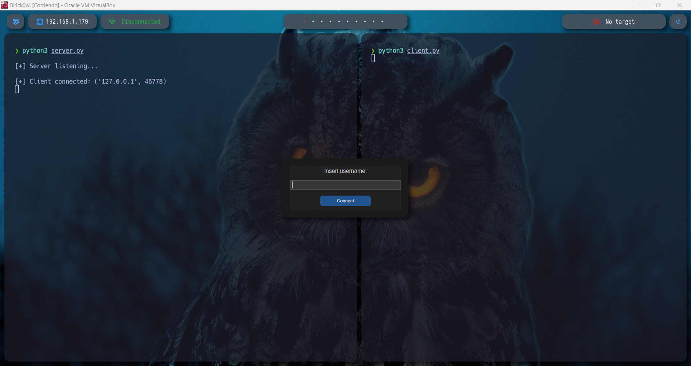
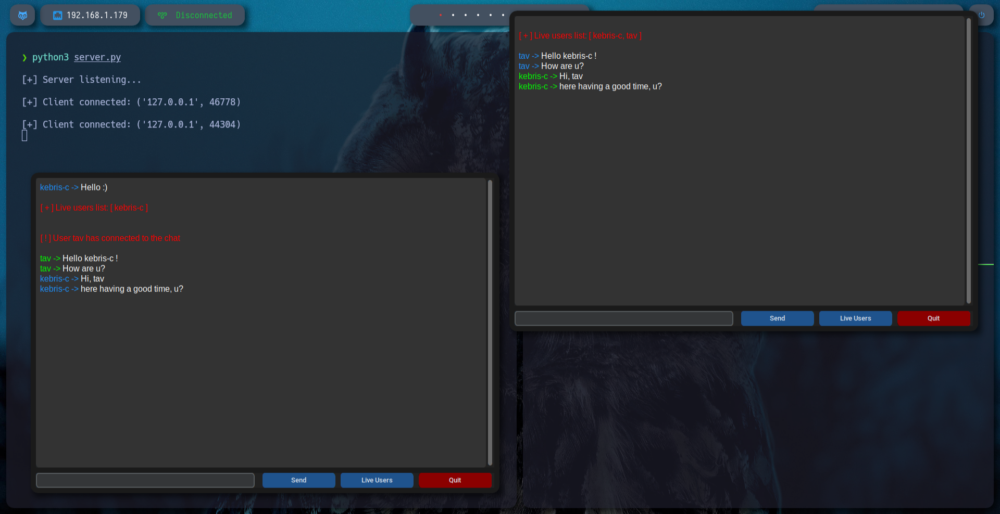

# Multi-User Encrypted Chat with GUI (Python)

A lightweight, local network multi-user chat application with end-to-end encrypted messaging and a simple, elegant GUI. Built purely in Python using `socket`, `ssl`, `threading`, and `customtkinter`.

---

## Features

- **Multi-user chat** on a local network.
- **End-to-end encryption** using TLS/SSL.
- **Simple GUI** for chat and username input.
- **Color-coded messages**:
  - Your messages: blue
  - Other users’ messages: green
  - System messages: red
- **Live users list** command to see who’s online.
- **Graceful handling** of user disconnects.
- Supports **arbitrary usernames**, even “weird” ones, without breaking the system.

---

## Installation

1. Clone the repository:
    ```bash
    git clone https://github.com/kebris-c/Multi-User-Encrypted-Chat-with-GUI/
    cd Multi-User-Encrypted-Chat-with-GUI/
    ```

2. Make sure you have Python 3.11+ installed.

3. Install dependencies:
    ```bash
    pip install customtkinter
    ```

4. Generate TLS certificates for the server:
    ```bash
    openssl genpkey -algorithm RSA -out server-key.key -aes256
    ```
    This statement generates a new RSA private key. The '-algorithm RSA' option specifies the use of the RSA algorithm. '-out server-key.key' indicates that the generated key will be saved in a file called 'server-key.key'. The '-aes256' option means that the private key will be encrypted using the AES-256 algorithm, which adds a layer of security by requiring a password to access the key.

    ```bash
    openssl req -new -key server-key.key -out server.csr
    ```
    This line creates a new Certificate Signing Request (CSR) using the RSA private key you generated. '-new' indicates that this is a new request, '-key server-key.key' specifies that the private key stored in 'server-key.key' will be used, and '-out server.csr' saves the generated CSR in a file called 'server.csr'. The CSR is required to request a digital certificate from a Certificate Authority (CA).

    ```bash
    openssl x509 -req -days 365 -in server.csr -signkey server-key.key -out server-cert.pem
    ```
    This command generates a self-signed certificate based on the CSR. '-req' indicates that a CSR is being processed, '-days 365' sets the validity of the certificate for one year, '-in server.csr' specifies the input CSR, '-signkey server-key.key' uses the same private key to sign the certificate, and '-out server-cert.pem' saves the generated certificate in a file called 'server-cert.pem'.

    ```bash
    openssl rsa -in server-key.key -out server-key.key
    ```
    This command is used to remove the password for a protected RSA private key. '-in server-key.key' specifies the encrypted private key file as input, and '-out server-key.key' indicates that the unencrypted private key will be saved in the same file. When you run this command, you'll be prompted for the current password for the private key. Once provided, OpenSSL will generate an unencrypted version of the private key and save it in the same file, overwriting the encrypted version. This step is often done to simplify automation in environments where entering a password manually is impractical. However, it is important to be aware that by removing the password, the private key becomes more vulnerable to unauthorized access.

---

## Usage

### Run the server

```bash
python3 server.py
```
Run a client
```bash
python3 client.py
```
A small GUI window will ask for your username.


After submitting, the main chat window opens.


Use Send or Enter to send messages.


Use Live Users to see all connected clients.
.png)

Use Quit to exit cleanly.
.png)

Technical Details
- Uses NDJSON (newline-delimited JSON) for message transport.
- Each client runs a dedicated receiving thread.
- Server manages clients with thread-safe operations.
- Handles malformed messages gracefully.
- User input sanitization ensures robustness, preventing crashes from weird names or unexpected input.

Personal Reflection
This project was more than just coding — it was an existential experience.
At 4 AM, debugging why colors didn’t match my obsessive vision of the username display, I found myself in a spiral of:

- JSON parsing tricks for the simplest formatting issues.
- Thread-safe client management to prevent server meltdowns.
- Multiple chiropractic sessions from being glued to the chair for hours.

All for a chat app where, ultimately, the colors of the usernames finally looked right no matter what the user typed. A true labor of love, insanity, and a testament to the small joys of programming perfectionism.
